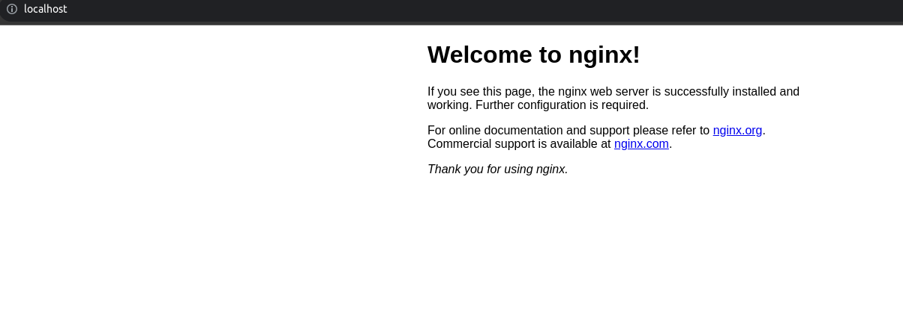
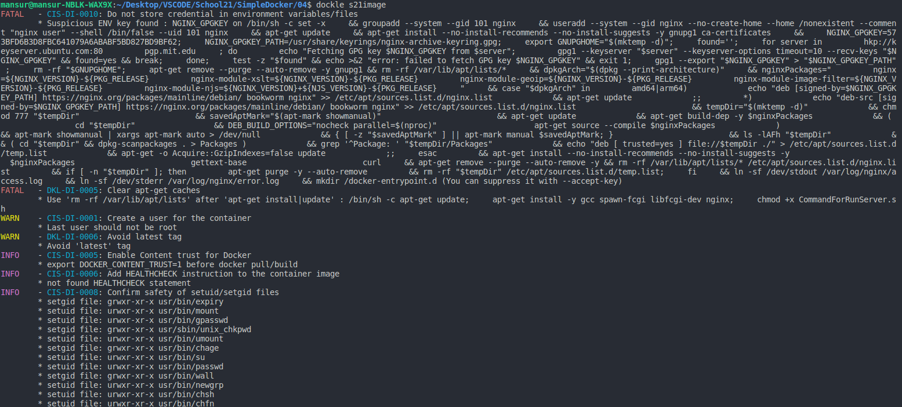
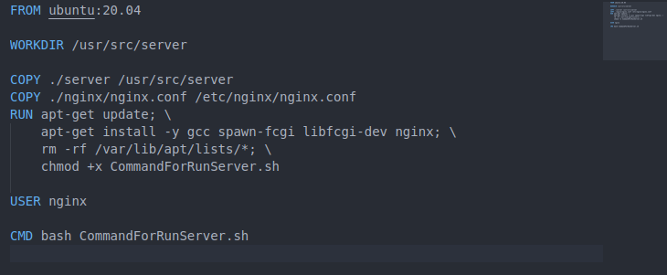

# Simple Docker

Введение в докер. Разработка простого докер образа для собственного сервера.

## Contents

1. [Chapter I](#chapter-i) \
    1.1. [Готовый докер](#part-1-готовый-докер) \
    1.2. [Операции с контейнером](#part-2-операции-с-контейнером) \
    1.3. [Мини веб-сервер](#part-3-мини-веб-сервер) \
    1.4. [Свой докер](#part-4-свой-докер) \
    1.5. [Dockle](#part-5-dockle) \
    1.6. [Базовый Docker Compose](#part-6-базовый-docker-compose)

## Part 1. Готовый докер
* Взял официальный докер образ с **nginx** и выкачал его при помощи `docker pull`

* Проверил наличие докера образа через `docker images`

* Запустил докер образа через `docker run -d [image_id|repository]`

* Проверил, что образ запустился через `docker ps`

* Посмотрел информацию о контейнере через `docker inspect [container_id|container_name]`

* По выводу команды определил и поместил в отчёт размер контейнера, список замапленных портов и ip контейнера
 `-` "Size": 186779301
`-`* ip: -
 `-` Ports: -
 `-` Порты не мапили, поэтому порты пустые, ip адрес не назначен

* Остановил докер образ через `docker stop [container_id|container_name]`. Проверил, что образ остановился через `docker ps`

* Запустить докер с портами 80 и 443 в контейнере, замапленными на такие же порты на локальной машине, через команду *run*

* Проверить, что в браузере по адресу *localhost:80* доступна стартовая страница **nginx**

* Перезапустил докер контейнер через `docker restart [container_id|container_name]. Проверил, что контейнер запустился

## Part 2. Операции с контейнером
##### Прочитать конфигурационный файл *nginx.conf* внутри докер контейнера через команду *exec*
* 

##### Создать на локальной машине файл *nginx.conf*
* 
##### Настроить в нем по пути */status* отдачу страницы статуса сервера **nginx**
* 
##### Скопировать созданный файл *nginx.conf* внутрь докер образа через команду `docker cp`
* 
##### Перезапустить **nginx** внутри докер образа через команду *exec*
* 
##### Проверить, что по адресу *localhost:80/status* отдается страничка со статусом сервера **nginx**
* 
##### Экспортировать контейнер в файл *container.tar* через команду *export*
* 
##### Остановить контейнер
* 
##### Удалить образ через `docker rmi [image_id|repository]`, не удаляя перед этим контейнеры
* 
##### Удалить остановленный контейнер
* 
##### Импортировать контейнер обратно через команду *import*
* 
##### Запустить импортированный контейнер
* 
##### Проверить, что по адресу *localhost:80/status* отдается страничка со статусом сервера **nginx**
* 

## Part 3. Мини веб-сервер

##### Написать мини сервер на **C** и **FastCgi**, который будет возвращать простейшую страничку с надписью `Hello World!`
* 
##### Запустить написанный мини сервер через *spawn-fcgi* на порту 8080
* 
##### Написать свой *nginx.conf*, который будет проксировать все запросы с 81 порта на *127.0.0.1:8080*
* 
##### Проверить, что в браузере по *localhost:81* отдается написанная вами страничка
* 

## Part 4. Свой докер

#### Итоговый докер образ, который:
* 

##### Собрать написанный докер образ через `docker build` при этом указав имя и тег
* 
##### Проверить через `docker images`, что все собралось корректно
* 
##### Запустить собранный докер образ с маппингом 81 порта на 80 на локальной машине и маппингом папки *./nginx* внутрь контейнера по адресу, где лежат конфигурационные файлы **nginx**'а
* 
##### Проверить, что по localhost:80 доступна страничка написанного мини сервера
* 
##### Дописать в *./nginx/nginx.conf* проксирование странички */status*, по которой надо отдавать статус сервера **nginx**
* 
##### Проверить, что теперь по *localhost:80/status* отдается страничка со статусом **nginx**
* 

## Part 5. **Dockle**

##### Просканировать образ из предыдущего задания через `dockle [image_id|repository]`

* 

##### Исправить образ так, чтобы при проверке через **dockle** не было ошибок и предупреждений
* 
